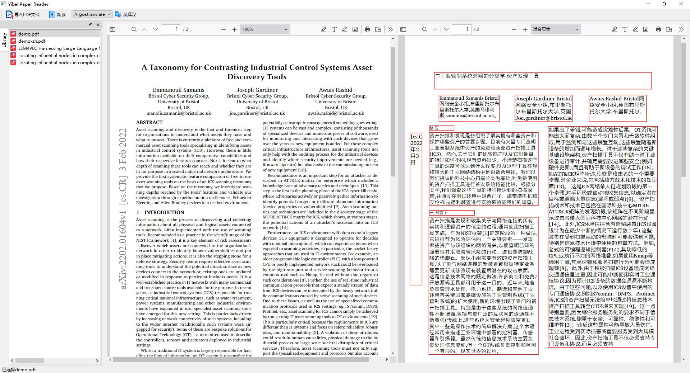

# Yibei_Reader
A bilingual paper reader, especially for Chinese users. 能够将英语论文对照翻译成中文。

## Features
- AI translation/reading models are offline-deployable;
- Support multiple AI-based translation models;
- Page layout are kept for comparative reading;
- Support reading, powered by Kokoro TTS, a state-of-the-art AI Text-to-Speech Model.



## Install
1. Python installed;
2. Clone this repository:
    ```bash
    git clone https://github.com/PiPiNaN/Yibei_Reader.git
    ```
3. Install packages:
   ```bash
   pip install requirements.txt
   ```
4. Download models from the internet and place them under 'models' folder, the models includes:
   - translate-en_zh-1_9.argosmodel (from https://www.argosopentech.com/)
   - opus-mt-en-zh 
   - m2m100_418M
   - mbart-large-50-many-to-many-mmt
    (the above three models can be downloaded from https://huggingface.co)
5. Start using as a PyQt GUI app:
   ```bash
   python yibei_app.py
   ```

## Acknowledgements
- Document processing: [PyMuPDF](https://github.com/pymupdf/PyMuPDF)
- https://www.argosopentech.com/
- https://huggingface.co and it's mirror https://hf-mirror.com/
- PySide6 (https://doc.qt.io/qtforpython-6/)
- pdf.js (https://mozilla.github.io/pdf.js/)